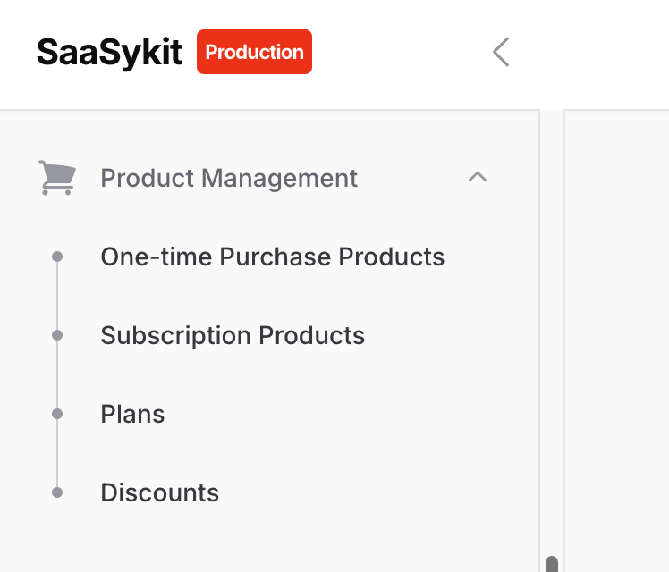

# Never accidentally edit your Filament production panel again!

[](https://packagist.org/packages/saasykit/filament-oops)

Filament Oops displays a clear 'Production' warning on your production Filament panel, helping you avoid costly mistakes and keeping your development safe.

Filament Oops uses the `APP_ENV` environment variable to determine the environment your Filament panel is running in. If you're running your Filament panel in production, Filament Oops will display a clear 'Production' warning on your panel.

<p align="center"></p>

You can also define custom environment names and colors if you want to customize the warning message for your specific environments.

## Installation

You can install the package via composer:

```bash
composer require saasykit/filament-oops
```

Optionally, you can publish the views using (in case you want to customize the views):

```bash
php artisan vendor:publish --tag="filament-oops-views"
```

## Usage

All you need to do is add the `FilamentOopsPlugin` to your `Filament` plugin list in your `FilamentServiceProvider` (usually located in `app/Providers/Filament/AdminPanelProvider.php`):

```php
class AdminPanelProvider extends PanelProvider
{
    public function panel(Panel $panel): Panel
    {
        return $panel
            // some other configurations
            ->plugins([
                FilamentOopsPlugin::make(),  // Add this line
            ]);
    }
}
```

### Customization

You can customize the environment names and colors by using the `addEnvironment` method on the `FilamentOopsPlugin`:

```php
class AdminPanelProvider extends PanelProvider
{
    public function panel(Panel $panel): Panel
    {
        return $panel
            // some other configurations
            ->plugins([
                FilamentOopsPlugin::make()->addEnvironment('local', 'Local', '#008000'),  // Add this line
            ]);
    }
}
```

## Contributing

Please see [CONTRIBUTING](.github/CONTRIBUTING.md) for details.

## Security Vulnerabilities

Please review [our security policy](../../security/policy) on how to report security vulnerabilities.

## Credits

- [SaaSykit](https://github.com/saasykit)
- [All Contributors](../../contributors)

## License

The MIT License (MIT). Please see [License File](LICENSE.md) for more information.
